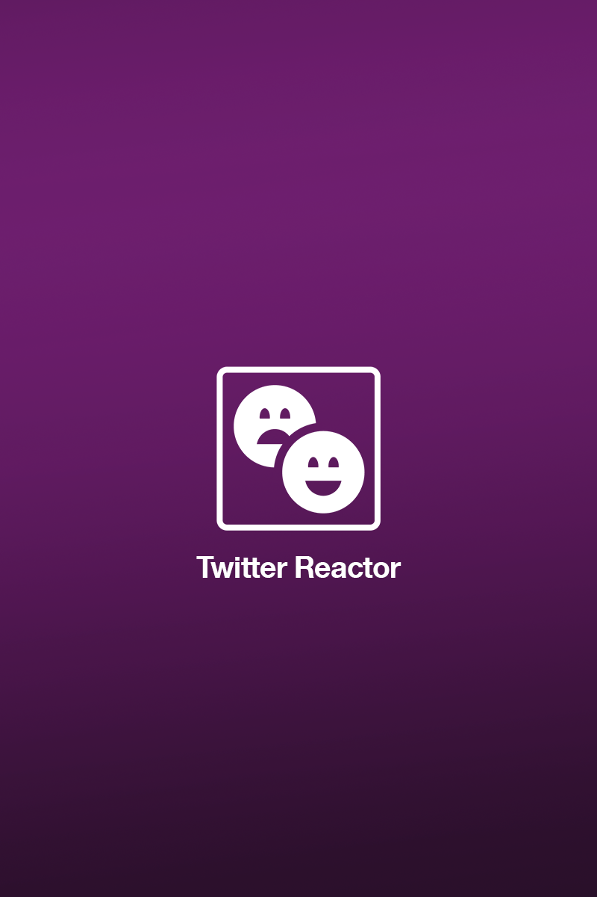

# Twitter Reactor

* Sentiment Analysis is the process of determining whether a piece of writing is positive, negative or neutral. A sentiment analysis system for text analysis combines natural language processing (NLP) and machine learning techniques to assign weighted sentiment scores to the entities, topics, themes and categories within a sentence or phrase.

* Sentiment analysis helps data analysts within large enterprises gauge public opinion, conduct nuanced market research, monitor brand and product reputation, and understand customer experiences. In addition, data analytics companies often integrate third-party sentiment analysis APIs into their own customer experience management, social media monitoring, or workforce analytics platform, in order to deliver useful insights to their own customers.

* In our case, we will analyze thousands of Twitter tweets to predict people’s sentiment. The function of the model is to output a label of ‘0’ when the tweet is positive, and ‘1’ when the tweet is negative.

## Twitter Reactor Tasks

The project is divided into 10 tasks. Here are the tasks in order:
1.	Importing Libraries and Datasets.
    [To download the dataset]( https://www.kaggle.com/arkhoshghalb/twitter-sentiment-analysis-hatred-speech) 
2.	Exploring the Dataset.
3.	Plotting the Word cloud.
4.	Perform Data Cleaning by removing Punctuation from Text.
5.	Perform Data Cleaning by removing Stopwords from Text.
6.	Perform Count Vectorization (Tokenization).
7.	Creating a Pipeline to remove Punctuations, Stopwords and Perform Count Vectorization.
8.	Train a Naive Bayes classifier model.
9.	Assess trained model performance.

## More infomation 
  To more infomation about machine learning project steps. [Go to my blog](https://baraasallout.wixsite.com/baraasallout/post/5-step-process-of-machine-learning-project) 

